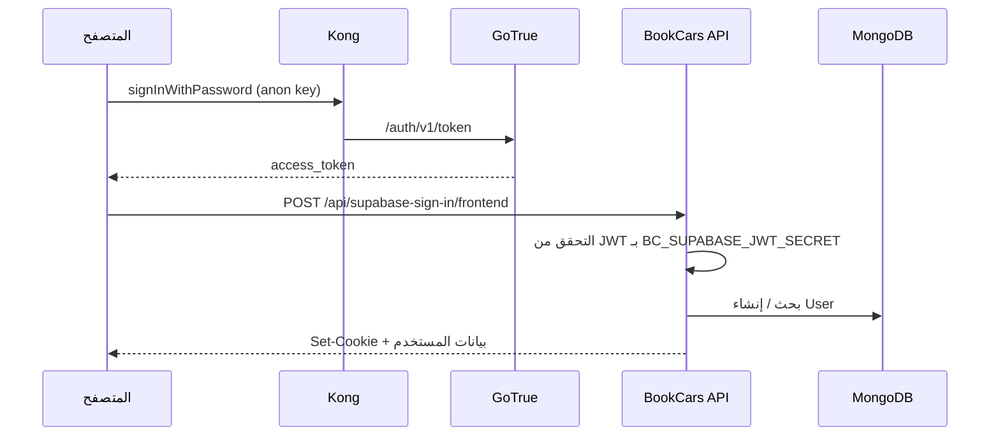

# Supabase الذاتي + BookCars — مرجع شامل

هذا الملف يلخّص **كل ما يخص** ربط **Supabase (Docker الرسمي)** بمشروع **Deal Car Rental / BookCars**: المنافذ، المتغيرات، الأوامر، التدفقات، استكشاف الأخطاء، وما يبقى يدويًا.

للنشر العام وقوائم مختصرة انظر أيضًا: [DEPLOYMENT.md](DEPLOYMENT.md).

---

## 1. ماذا لديك في النظام

| جزء | الوصف |
|-----|--------|
| **BookCars** | ويب (`bc-frontend`)، API (`bc-backend`)، أدمن، تطبيق موبايل، MongoDB |
| **Supabase (self-host)** | Kong، GoTrue (Auth)، PostgREST، Studio، Storage، Realtime، DB، Pooler (Supavisor)، … |
| **الجسر** | العميل يسجّل الدخول عبر **Supabase**؛ الـ API يتحقق من **JWT Supabase** ثم ينشئ/يربط **User** في Mongo ويصدر **جلسة BookCars** (كوكي ويب أو توكن موبايل) |

---

## 2. المنافذ المحلية الافتراضية

| الخدمة | عنوان |
|--------|--------|
| واجهة الويب (nginx) | `http://localhost:13080` |
| API BookCars | `http://localhost:4002` |
| لوحة الأدمن | `http://localhost:3001` |
| Mongo على المضيف | `localhost:27018` |
| **Supabase عبر Kong** | قيمة **`SUPABASE_PUBLIC_URL`** في `supabase/docker/.env`؛ مع المكدس الموحّد (`docker:up:supabase`) القالب يدمج **`http://localhost:8010`** من `infra/supabase-bookcars-stack.fragment.env` |

**قاعدة ذهبية:** `KONG_HTTP_PORT` و`SUPABASE_PUBLIC_URL` و`API_EXTERNAL_URL` يجب أن تتسق (نفس منفذ HTTP العام).  
واجهة BookCars: `VITE_BC_SUPABASE_URL` = `SUPABASE_PUBLIC_URL`.  
الموبايل (محاكي): `BC_SUPABASE_URL` = استبدال `localhost` بـ **`10.0.2.2`** مع **نفس المنفذ**.

---

## 3. متغيرات البيئة الحرجة

### 3.1 `supabase/docker/.env`

| متغير | دوره |
|--------|------|
| `JWT_SECRET` | توقيع JWT (GoTrue وما شابه) — يجب أن يساوي `BC_SUPABASE_JWT_SECRET` في BookCars |
| `ANON_KEY` | المفتاح العام للعميل — يطابق `VITE_BC_SUPABASE_ANON_KEY` و `BC_SUPABASE_ANON_KEY` |
| `SUPABASE_PUBLIC_URL` / `API_EXTERNAL_URL` | عنوان Kong الذي يراه المتصفح/التطبيق |
| `KONG_HTTP_PORT` / `KONG_HTTPS_PORT` | نشر المنافذ على المضيف |
| `SITE_URL` / `ADDITIONAL_REDIRECT_URLS` | إعادة توجيه GoTrue — يجب أن تشمل واجهة الويب (مثلاً `http://localhost:13080`) |
| `ENABLE_EMAIL_AUTOCONFIRM` | `true` للتطوير المحلي بدون SMTP (لا تُنصح للإنتاج بدون مراجعة) |
| `DASHBOARD_USERNAME` / `DASHBOARD_PASSWORD` | **Basic Auth** لـ Studio على مسار `/` عبر نفس عنوان Kong |
| `POSTGRES_PORT` وغيره | عند تعارض `5432` على المضيف، غيّر المنفذ وابقَ التوافق مع بقية الخدمات |

### 3.2 BookCars

| ملف | متغيرات Supabase |
|-----|-------------------|
| `backend/.env.docker` | `BC_SUPABASE_JWT_SECRET` = **`JWT_SECRET`** (ليس service role) |
| `frontend/.env.docker` | `VITE_BC_SUPABASE_URL`, `VITE_BC_SUPABASE_ANON_KEY` |
| `mobile/.env` | `BC_SUPABASE_URL`, `BC_SUPABASE_ANON_KEY` |

**قوالب:** `*.env.example`, `mobile/.env.docker.android.example`, **`mobile/.env.physical-device.example`** (هاتف حقيقي + `192.168.x.x`).

**مرجع نصي:** `infra/supabase-self-host.defaults.env`, `infra/supabase-gotrue-bookcars.fragment.env`, **`infra/supabase-bookcars-stack.fragment.env`** (منافذ بجانب BookCars).

---

## 4. أوامر npm (من جذر المستودع)

| الأمر | الوظيفة |
|--------|---------|
| `npm run supabase:clone-docker` | يستنسخ [Supabase docker الرسمي](https://github.com/supabase/supabase/tree/master/docker) إلى **`supabase/docker/`** (مستبعد من Git) ثم يشغّل دمج BookCars + LF |
| `npm run docker:up:supabase` | `docker compose -p bookcars -f docker-compose.yml -f supabase/docker/docker-compose.yml up -d --build` |
| `npm run docker:down:supabase` | إيقاف نفس المكدس |
| `npm run supabase:merge-gotrue` | يحدّث `SITE_URL` و`ADDITIONAL_REDIRECT_URLS` لـ BookCars؛ يدمج منافذ `supabase-bookcars-stack.fragment.env`؛ على Windows يطبّع **LF** لـ `kong-entrypoint.sh` و`pooler.exs` |
| `npm run supabase:merge-gotrue:fix-lf` | نفس الدمج + فرض تطبيع LF على أي نظام |
| `npm run supabase:sync-bookcars` | يزامن `JWT_SECRET`, `ANON_KEY`, `SUPABASE_PUBLIC_URL` → `backend/.env.docker`, `frontend/.env.docker`, `mobile/.env` |
| `npm run supabase:verify-local` | يتحقق من `auth/v1/health` و`rest/v1/` عبر `SUPABASE_PUBLIC_URL` |
| `npm run supabase:seed-user` | مستخدم تجريبي افتراضي (`dev@bookcars.local` / `BookcarsLocalDev1!`)؛ إن وُجد لا يفشل |
| `npm run supabase:apply-docker` | verify + sync + `restart bc-backend` + build/up `bc-frontend` |

**مسارات اختيارية:** `--supabase-dir`, `--bookcars-root`، ومع `apply-docker`: `--no-docker`, `--no-frontend-rebuild`, `--skip-verify`, `--skip-sync`.

**مثال (مسار Supabase مخصص على Windows):**

```bash
npm run supabase:apply-docker -- --supabase-dir "C:\Users\YOU\supabase\docker"
```

---

## 5. تدفق المصادقة (ويب)



**ملفات مرجعية في الكود:**

- المسار: `backend/src/config/userRoutes.config.ts` → `POST /api/supabase-sign-in/:type`
- المنطق: `backend/src/controllers/userController.ts` → `supabaseSignin`
- التحقق من JWT: `backend/src/utils/authHelper.ts`
- الواجهة: `frontend/src/pages/SignIn.tsx`, `frontend/src/services/supabaseClient.ts`
- الموبايل: `mobile/services/supabaseClient.ts`, `mobile/config/env.config.ts`, شاشة تسجيل الدخول

**لوحة الأدمن:** الـ API يقبل نوع `admin` لمسار supabase-sign-in، لكن واجهة **Admin** قد لا تعرض زر Supabase؛ الدخول هناك غالبًا بالبريد/كلمة BookCars ما لم تُضف واجهة مشابهة للويب.

---

## 6. سير عمل بعد تعديل `supabase/docker/.env`

1. يُفضّل: **`npm run supabase:apply-docker`** (مع `--supabase-dir` إن لزم).
2. يدويًا مختصر: `supabase:verify-local` → `supabase:sync-bookcars` → `docker compose restart bc-backend` → إن تغيّر `VITE_*`: `docker compose build bc-frontend && docker compose up -d bc-frontend`.
3. بعد تغيير إعدادات GoTrue فقط: داخل مجلد supabase docker أعد تشغيل حاوية **auth**.
4. إن اختفت نشر منافذ Kong على المضيف: `docker compose up -d --force-recreate kong`.

---

## 7. Windows — CRLF وملفات حساسة

| العرض | الملف | الحل |
|--------|--------|------|
| Kong: `exec ... kong-entrypoint.sh: no such file or directory` | `supabase/docker/volumes/api/kong-entrypoint.sh` | تحويل إلى **LF** أو `npm run supabase:merge-gotrue` |
| Pooler: خطأ Elixir **carriage return** | `supabase/docker/volumes/pooler/pooler.exs` | تحويل إلى **LF** ثم `docker compose restart supavisor` (خدمة **`supavisor`** في compose) |

في مستودع BookCars: `.gitattributes` يفرض **`*.sh` → eol=lf** لسكربتات المشروع.

---

## 8. Supabase Studio

- غالبًا نفس **`SUPABASE_PUBLIC_URL`** على المسار **`/`** مع **Basic Auth** (`DASHBOARD_USERNAME` / `DASHBOARD_PASSWORD`).
- API العامة (Auth/REST) تبقى تحت نفس الـ host حسب إعداد Kong الرسمي.

---

## 9. ما لا يُؤتمت (مسؤوليتك حسب البيئة)

- كلمات مرور وأسرار **إنتاج** قوية؛ تدوير `JWT_SECRET` ثم **`supabase:sync-bookcars`** وإعادة البناء.
- **SMTP** وتأكيد البريد في الإنتاج بدل الاعتماد على `ENABLE_EMAIL_AUTOCONFIRM=true` فقط.
- **MyFatoorah:** `BC_FRONTEND_HOST` يجب أن يطابق أصل الزوار (غالبًا HTTPS عام؛ ليس `localhost` في الإنتاج).
- **Expo push:** `BC_EXPO_ACCESS_TOKEN` في الـ backend.
- **Android:** `google-services.json` الحقيقي عند الحاجة لـ FCM.
- **هاتف حقيقي:** انسخ من `mobile/.env.physical-device.example` واستبدل عنوان IP.

---

## 10. فهرس سكربتات المستودع

| الملف | الوظيفة |
|--------|---------|
| `__scripts/supabase/parse-supabase-env.mjs` | قراءة `supabase/docker/.env`؛ **`defaultSupabaseDockerDir()`** يفضّل `./supabase/docker` ثم `~/supabase/docker` |
| `__scripts/supabase/clone-official-docker.mjs` | استنساخ الرسمي إلى `supabase/docker` + دمج |
| `__scripts/supabase/merge-gotrue-bookcars.mjs` | دمج GoTrue + منافذ المكدس + تطبيع LF |
| `__scripts/supabase/sync-bookcars-from-supabase.mjs` | مزامنة الأسرار والعناوين إلى BookCars |
| `__scripts/supabase/verify-supabase-local.mjs` | فحص سريع للبوابة |
| `__scripts/supabase/seed-local-auth-user.mjs` | مستخدم تجريبي |
| `__scripts/supabase/apply-supabase-to-docker.mjs` | سلسلة verify + sync + Docker |

---

*آخر تحديث منطقي للمحتوى: يتوافق مع سكربتات `package.json` الحالية ومسارات `docs/DEPLOYMENT.md`.*
